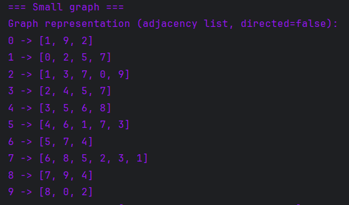
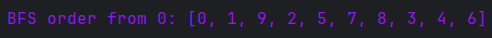
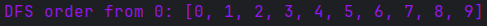
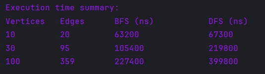

# Assignment 4: Graph Traversal and Representation System

## A. Project Overview

This project is a Java program that implements a graph traversal and representation system.

The graph is represented using an adjacency list. The program supports two graph traversal algorithms:

- Breadth-First Search (BFS)
- Depth-First Search (DFS)

The program creates three graphs of different sizes:

| Graph Size | Number of Vertices |
|---|---:|
| Small | 10 |
| Medium | 30 |
| Large | 100 |

For each graph, the program runs BFS and DFS, measures execution time using `System.nanoTime()`, and prints the results.

The graph is undirected, which means that every edge works in both directions.

Example:

```text
0 -> 1
1 -> 0
```

The graph structure and additional edges are generated randomly. Because of this, the graph output, traversal order, number of edges, and execution time may be different in each run.

---

## Graph Structure

A graph consists of vertices and edges.

A **vertex** is a node in the graph.

Example:

```text
Vertex 0
Vertex 1
Vertex 2
```

An **edge** is a connection between two vertices.

Example:

```text
0 -> 1
```

This means that vertex `0` is connected to vertex `1`.

---

## B. Class Descriptions

## Vertex Class

The `Vertex` class represents a node in the graph.

### Field

```java
private final int id;
```

The `id` field is a unique identifier for each vertex.

### Methods

| Method | Description |
|---|---|
| `Vertex(int id)` | Creates a vertex with a given ID |
| `getId()` | Returns the vertex ID |
| `toString()` | Converts the vertex to a readable string |

### Purpose

The `Vertex` class is used to create and store graph nodes.

---

## Edge Class

The `Edge` class represents a connection between two vertices.

### Fields

```java
private final Vertex source;
private final Vertex destination;
```

| Field | Description |
|---|---|
| `source` | Starting vertex |
| `destination` | Ending vertex |

### Methods

| Method | Description |
|---|---|
| `Edge(Vertex source, Vertex destination)` | Creates an edge between two vertices |
| `getSource()` | Returns the source vertex |
| `getDestination()` | Returns the destination vertex |
| `toString()` | Converts the edge to readable format |

### Purpose

The `Edge` class is used to store graph connections.

---

## Graph Class

The `Graph` class represents the full graph structure.

It stores:

- vertices
- edges
- adjacency list
- graph type: directed or undirected

### Fields

```java
private final boolean directed;
private final Map<Integer, Vertex> vertices;
private final Map<Integer, Set<Integer>> adjacencyList;
private final List<Edge> edges;
```

### Methods

| Method | Description |
|---|---|
| `addVertex(Vertex vertex)` | Adds a vertex to the graph |
| `addEdge(int from, int to)` | Adds an edge between two vertices |
| `printGraph()` | Prints the graph as an adjacency list |
| `bfs(int start)` | Prints BFS traversal order |
| `dfs(int start)` | Prints DFS traversal order |
| `bfsTraversal(int start)` | Returns BFS traversal order |
| `dfsTraversal(int start)` | Returns DFS traversal order |
| `getVertexCount()` | Returns number of vertices |
| `getEdgeCount()` | Returns number of edges |

### Purpose

The `Graph` class is responsible for graph representation and traversal.

---

## Experiment Class

The `Experiment` class handles execution and analysis.

### Methods

| Method | Description |
|---|---|
| `runTraversals(Graph graph)` | Runs BFS and DFS on a graph |
| `runMultipleTests()` | Runs tests on 10, 30, and 100 vertices |
| `createGraph(...)` | Creates a graph with random edges |
| `printResults()` | Prints execution time comparison |
| `testGraph(...)` | Measures BFS and DFS performance |

### Purpose

The `Experiment` class separates experiment logic from graph logic. It creates test graphs, runs traversal algorithms, measures time, and prints results.

---

## Main Class

The `Main` class is the starting point of the program.

```java
public static void main(String[] args) {
    Experiment experiment = new Experiment();
    experiment.runMultipleTests();
}
```

It creates an `Experiment` object and starts all tests.

---

## Adjacency List Representation

The graph is represented using an adjacency list.

An adjacency list stores each vertex with a list of its connected neighbors.

Example:

```text
0 -> [1, 4, 7]
1 -> [0, 2]
2 -> [1, 3]
```

This means:

- Vertex `0` is connected to vertices `1`, `4`, and `7`
- Vertex `1` is connected to vertices `0` and `2`
- Vertex `2` is connected to vertices `1` and `3`

In the code, adjacency list is stored using:

```java
private final Map<Integer, Set<Integer>> adjacencyList;
```

This representation is efficient because it stores only existing connections and allows BFS and DFS to access neighbors quickly.

---

# C. Algorithm Descriptions

## Breadth-First Search BFS

Breadth-First Search, or BFS, is a graph traversal algorithm that visits vertices level by level.

BFS starts from a selected vertex and first visits all direct neighbors. Then it visits the neighbors of those neighbors.

BFS uses a queue.

A queue follows this rule:

```text
First In, First Out
```

This means that the first vertex added to the queue will be processed first.

---

## BFS Step-by-Step Explanation

Example graph:

```text
0 -> [1, 2]
1 -> [3]
2 -> [4]
3 -> []
4 -> []
```

Starting vertex:

```text
0
```

Step 1:

```text
Visit 0
Queue: [1, 2]
Visited: [0]
```

Step 2:

```text
Visit 1
Queue: [2, 3]
Visited: [0, 1]
```

Step 3:

```text
Visit 2
Queue: [3, 4]
Visited: [0, 1, 2]
```

Step 4:

```text
Visit 3
Queue: [4]
Visited: [0, 1, 2, 3]
```

Step 5:

```text
Visit 4
Queue: []
Visited: [0, 1, 2, 3, 4]
```

Final BFS order:

```text
0, 1, 2, 3, 4
```

---

## BFS Use Cases

BFS is useful when we need to explore a graph level by level.

Common use cases:

- Finding the shortest path in an unweighted graph
- Finding the nearest connection in a network
- Searching in social networks
- Solving maze problems
- Finding the minimum number of steps

---

## BFS Time Complexity

The time complexity of BFS is:

```text
O(V + E)
```

Where:

- `V` is the number of vertices
- `E` is the number of edges

BFS visits each vertex at most once and checks each edge at most once.

---

## Depth-First Search DFS

Depth-First Search, or DFS, is a graph traversal algorithm that goes as deep as possible along one path before backtracking.

DFS starts from a selected vertex, visits one neighbor, then continues to the next neighbor deeply.

DFS uses a stack.

In this project, DFS is implemented using `ArrayDeque` as a stack.

---

## DFS Step-by-Step Explanation

Example graph:

```text
0 -> [1, 2]
1 -> [3]
2 -> [4]
3 -> []
4 -> []
```

Starting vertex:

```text
0
```

Step 1:

```text
Visit 0
Go to 1
Visited: [0]
```

Step 2:

```text
Visit 1
Go to 3
Visited: [0, 1]
```

Step 3:

```text
Visit 3
No unvisited neighbors
Backtrack
Visited: [0, 1, 3]
```

Step 4:

```text
Return and visit 2
Visited: [0, 1, 3, 2]
```

Step 5:

```text
Visit 4
Visited: [0, 1, 3, 2, 4]
```

Final DFS order:

```text
0, 1, 3, 2, 4
```

---

## DFS Use Cases

DFS is useful when we need to explore paths deeply.

Common use cases:

- Checking if a path exists
- Finding connected components
- Cycle detection
- Exploring all possible paths
- Solving puzzles and mazes

---

## DFS Time Complexity

The time complexity of DFS is:

```text
O(V + E)
```

Where:

- `V` is the number of vertices
- `E` is the number of edges

DFS visits each vertex at most once and checks each edge at most once.

---

## BFS vs DFS Comparison

| Feature | BFS | DFS |
|---|---|---|
| Full Name | Breadth-First Search | Depth-First Search |
| Data Structure | Queue | Stack |
| Traversal Style | Level by level | Deep path first |
| Best Use | Shortest path in unweighted graphs | Deep exploration |
| Time Complexity | O(V + E) | O(V + E) |
| Limitation | Can use more memory on wide graphs | Does not guarantee shortest path |

---

# D. Experimental Results

The program performs experiments on three graph sizes:

| Graph Type | Vertices |
|---|---:|
| Small | 10 |
| Medium | 30 |
| Large | 100 |

The edges are generated randomly. Because of this, the exact number of edges and execution time can be different every time the program runs.

## Example Result

| Graph Type | Vertices | Edges | BFS Time ns | DFS Time ns |
|---|---:|---:|---:|---:|
| Small | 10 | 21 | 70800 | 75600 |
| Medium | 30 | 79 | 83400 | 132600 |
| Large | 100 | 349 | 205600 | 389400 |

---

## Example Console Output

```text
=== Small graph ===
Graph representation (adjacency list, directed=false):
0 -> [1, 4, 7, 8]
1 -> [0, 2, 8, 3, 7]
2 -> [1, 3, 9, 8]
3 -> [2, 4, 1]
4 -> [3, 5, 0, 9, 7]
5 -> [4, 6, 7]
6 -> [5, 7, 9]
7 -> [6, 8, 0, 5, 4, 1]
8 -> [7, 9, 1, 2, 0]
9 -> [8, 4, 6, 2]

BFS order from 0: [0, 1, 4, 7, 8, 2, 3, 5, 9, 6]
DFS order from 0: [0, 1, 2, 3, 4, 5, 6, 7, 8, 9]

=== Medium graph ===
Graph has 30 vertices and 79 edges.
Traversal order is hidden for readability.
Execution time is shown in the summary table.

=== Large graph ===
Graph has 100 vertices and 349 edges.
Traversal order is hidden for readability.
Execution time is shown in the summary table.

Execution time summary:
Vertices   Edges      BFS (ns)           DFS (ns)
10         21         70800              75600
30         79         83400              132600
100        349        205600             389400

Small graph traversal order details:
BFS order: [0, 1, 4, 7, 8, 2, 3, 5, 9, 6]
DFS order: [0, 1, 2, 3, 4, 5, 6, 7, 8, 9]
```

---

## Observations and Patterns

As the graph size increases, the execution time usually increases as well. This happens because BFS and DFS need to process more vertices and edges.

However, the time does not always grow perfectly because:

- the graph is generated randomly
- Java runtime performance can vary
- system load can affect execution time
- the measured time is very small and uses nanoseconds

In the example result, BFS was faster than DFS for medium and large graphs. However, both algorithms have the same theoretical time complexity: `O(V + E)`.

---

# Analysis Questions

## 1. How does graph size affect BFS and DFS performance?

Graph size affects performance because larger graphs contain more vertices and edges. BFS and DFS must visit vertices and check edges, so larger graphs usually take more time.

---

## 2. Which traversal is faster in your experiments?

In the example experiment, BFS was faster than DFS for medium and large graphs.

However, this result can change in different runs because the graph is generated randomly.

---

## 3. Do results match the expected complexity O(V + E)?

Yes. The results generally match the expected complexity `O(V + E)` because both BFS and DFS visit each vertex at most once and check each edge at most once.

---

## 4. How does graph structure affect traversal order?

Graph structure affects traversal order because BFS and DFS follow different rules.

BFS visits vertices level by level.

DFS goes deep along one path before backtracking.

The order of neighbors in the adjacency list also affects the final traversal order.

---

## 5. When is BFS preferred over DFS?

BFS is preferred when we need to find the shortest path in an unweighted graph.

Examples:

- shortest path between two nodes
- minimum number of steps in a maze
- nearest connection in a network

---

## 6. What are the limitations of DFS?

DFS has several limitations:

- DFS does not guarantee the shortest path.
- DFS can go very deep before finding the target.
- Recursive DFS can cause stack overflow.
- DFS traversal order depends on neighbor order.

In this project, DFS is implemented using a stack instead of recursion.

---

# E. Screenshots

Screenshots are stored in:

```text
docs/screenshots/
```

## Graph Structure Output



## BFS Traversal Output



## DFS Traversal Output



## Performance Results



---

# F. Reflection

During this assignment, I learned how to represent graphs in Java using vertices, edges, and adjacency lists. I also learned how BFS and DFS work differently. BFS explores the graph level by level, while DFS goes deep into one path before backtracking.

The main challenge was understanding how random graph structure affects traversal order and execution time. Since the graph is generated randomly, the output can change in every run. This helped me understand that graph structure directly affects algorithm behavior.

---

